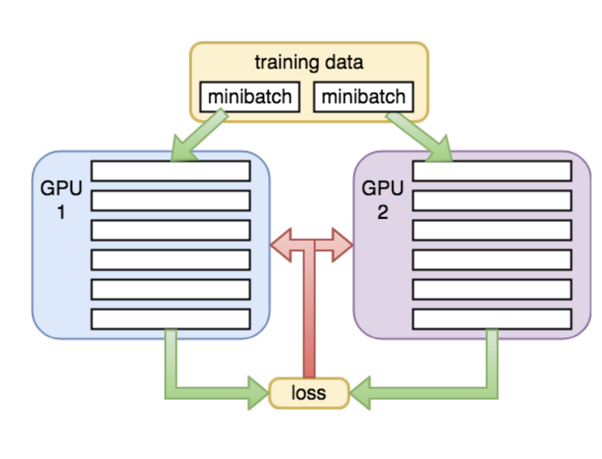
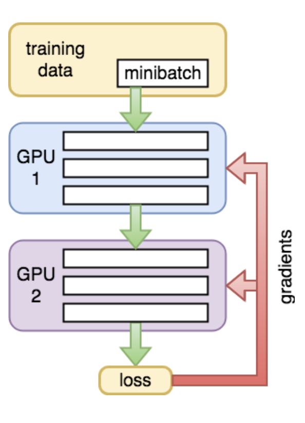
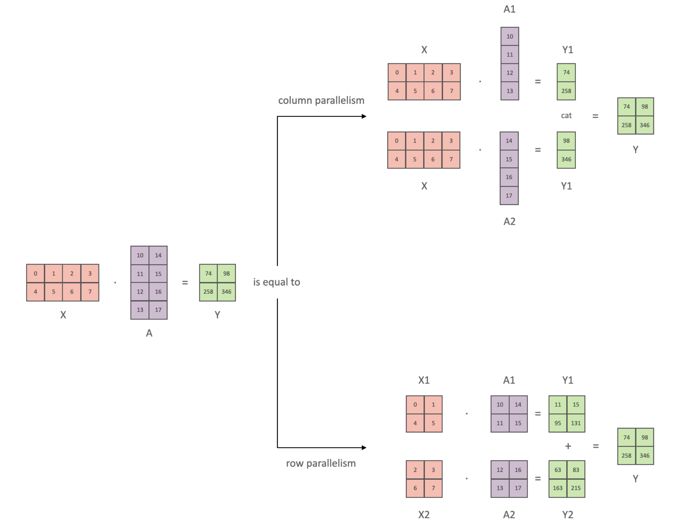

# Single GPU vs Multi-GPU training
- Training ML models could be intense
  - Heavy computations
  - Large Model
- That's why we might need use multiple GPUs to train
  - GPUs could be accross multiple nodes
- Multi-GPU or Multi-Node training has overhead
  - Communication costs
  - Distributation of the data
  - Underutilization


# Multi-GPU performance
<div class="column"  style="width:100%; text-align: center;">
  {width=40%}
</div>
- ResNet152 with CIFAR100 multi-gpu performance


# Single-GPU Training
<div class="column"  style="width:58%">
  {width=25%}
</div>
<div class="column"  style="width:40%">
  - <small>How it works: </small>
  - <small>Entire model & data on one GPU.</small>
  - <small>Pros: Simple, fast for small models.</small>
  - <small>Cons: Not scalable to large models/datasets.</small>  
</div>
- Oveheads: No major overhead


# DataLoader issue
- Most common bottolneck in workflows
- Causes the dnderutilization issue
- Reserve enough CPU cores per GPU, 7 cores/GPU on LUMI
- Use multiple workers (processes) in PyTorch DataLoader
```python
train_loader = torch.utils.data.DataLoader(data,...,num_workers=N)
```
{width=60%}

# Multi-GPU techniques
<div class="column"  style="width:50%">
  Data Parallelism
  {width=50%}
</div>
<div class="column"  style="width:50%">
  Model Parallelism (MP)
  {width=50%}
</div>

# Data Parallelism
<div class="column"  style="width:58%">
  {width=50%}
</div>
<div class="column"  style="width:40%">
  - <small>How it works:</small>
  - <small>Copy model to each GPU.</small>
  - <small>Split inputs across GPUs.</small>
  - <small>Compute forward/backward.</small>
  - <small>Aggregate gradients.</small>
</div>    

# Naive Pytroch Data Parallelism (DP)
  {width=75%}


# Pytroch Distributed Data Parallelism (DDP)
  {width=75%}


# DDP vs DP
- DP is Python threads-based, DDP is multiprocess-based 
  - No Python threads limitations, such as GIL
- Simpler data flow
- Both have high inter-GPU communication overhead (all-reduce)
  - DDP has a lower overhead, but still high
- Overlapping pipeline of gradient all-reduce with layer gradient computation
- DDP is generally the recommended approach


# MP: Pipeline Parallelism
<div class="column"  style="width:50%">
  {width=60%}
</div>
<div class="column"  style="width:40%">
  - <small>Idea: Split model layer-wise across GPUs.</small>
  - <small>Each GPU processes part of the model sequentially</small>
  - <small>Underutilization is an issue</small>
  - <small>Maximizes compute by overlapping stages (with microbatching).</small>
</div>


# Bubble issue and GPipe
<div class="column"  style="width:80%; text-align: center;">
  {width=80%}
  - <small>Picture from [GPipe Paper, arXiv:1811.06965](https://arxiv.org/abs/1811.06965)</small>
</div>
- GPipe divided the data to micro-batch to reduce the bubble issue.


# MP: Tensor Parallelism
<div class="column"  style="width:58%">
  {width=60%}
</div>
<div class="column"  style="width:40%">
  - <small>Horizontal Parallelism:</small>
  - <small>Divide horizontally</small>
  - <small>Store part of the layers or blocks on different GPUs.</small>
  - <small>Concat outputs between GPUs manually.</small>
</div>  


# How MP works?
<div class="column"  style="width:100%; text-align: center;">
  {width=70%}
</div>


# Reality: 3D Parallelism
<div class="column"  style="width:100%; text-align: center;">
  {width=40%}
</div>
- In real world: Data Parallel + Tensor Parallel + Pipeline Parallel are combined.
- Example: Training GPT-3 used all three.


# ZeRO: Advance Data Parallelism
- Issue with DP: Full optimizer states and gradients duplicated on every GPU.
  - Not efficient with VRAM
- ZeRO Idea: Partition optimizer states, gradients, and parameters across GPUs.
- Result: Efficient use of VRAM
  - Train MUCH larger models without running out of memory.

# ZeRO
<div class="column"  style="width:100%; text-align: center;">
  {width=80%}
</div>

# Summary
- Model fits onto a single GPU -> DDP or ZeRO
- Model doesn’t fit onto a single GPU
  - Fast intra-node/GPU connection -> PP, ZeRO, TP
  - Without intra-node/GPU connection -> PP
- Largest Layer not fitting into a single GPU -> TP
- Multi-Node / Multi-GPU:
  - ZeRO - as it requires close to no modifications to the model
  - PP+TP+DDP: less communications, but requires massive changes to the model
  - PP+TP+ZeRO: when you have slow inter-node connectivity and still low on GPU memory
