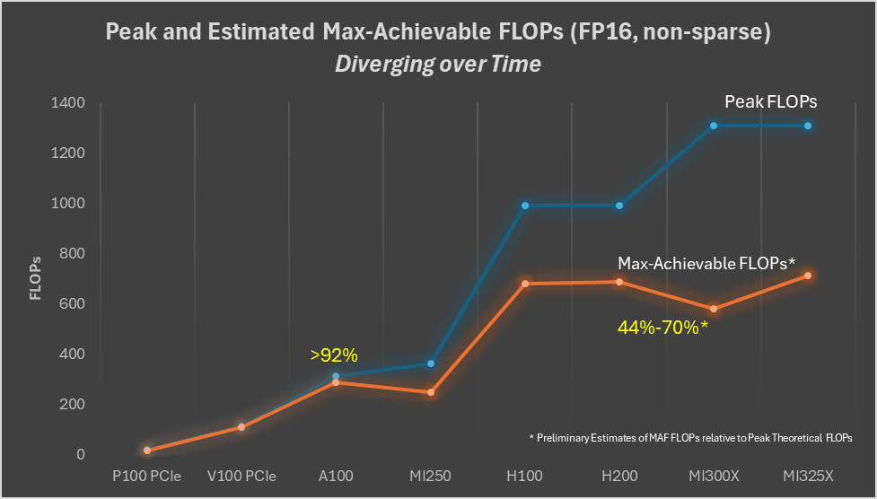

# GPUs on LUMI-G

<div class="column"  style="width:50%; text-align: center;">
  {width=90%}
  <small>LUMI-G Node.</small>
</div>
<div class="column"  style="width:50%; text-align: center;">
  {width=50%}
  <small>Single AMD MI250 GPU</small>
</div>

# FLOPs (Floating Point Operations)

- FLOPs measure how many arithmetic operations a model performs.
- Commonly used to estimate compute cost of training/inference.
- Training ML Models = 2 × FLOPs/pass (forward + backward).

# GPU Characteristics
- Computer Power
    - Peak FP64 Performance: 47.9 TFLOPs
    - Peak FP32 Performance: 95.7 TFLOPs
    - Peak FP16 Performance: 383 TFLOPs

- Memory
- 128 GB HBM2e (64 GB per GCD)
- 3.2 TB/s total memory bandwidth

# Peak vs Max-Achievable FLOPs
<div class="column"  style="width:60%; text-align: center;">
  {width=80%}
  <small>Picture from [AMD](https://rocm.blogs.amd.com/software-tools-optimization/Understanding_Peak_and_Max-Achievable_FLOPS/README.html)</small>
</div>
<div class="column"  style="width:60%">
  - <small>Peak performance is calculated based on the hardware charachteristics</small>
  - <small>$FLOPs/s = Cores \times Ops/Cyle \times Clock$</small>
  - <small>Memory Bandwidth Limits, Underutilization, Load Imbalance, etc.</small>
  - <small>Memory Bandwidth Limits, Underutilization, Load Imbalance, etc.</small>
  - <small>Usually **35-70% of Peak FLOPs**</small>
</div>

# ML Parameters vs FLOPs

- **No. Parameters** are static — they define the model size.
- **FLOPs** depend on:
    - Input image size
    - Number of filters
    - Spatial dimensions
    - Batch size (for total cost)

- A model with few parameters can still have high FLOPs if it processes high-resolution inputs.

# VRAM Usage Breakdown

| Component            | Description                                  |
|---------------------|----------------------------------------------|
| Model Parameters     | Static memory for weights                    |
| Gradients            | Stored during backpropagation                |
| Optimizer States     | e.g., momentum/Adam stats                    |
| Activations          | Largest source — intermediate tensors        |
| Framework Overhead   | Memory allocator, workspace, caching         |

- Peak VRAM usage is dominated by activations in deep CNNs.

# Example: ResNet-152 with CIFAR-100

- **Model Info:**
    - Parameters: ~60.2M
    - FLOPs per image (forward): ~11.5 GFLOPs
    - Training FLOPs per image: ~23 GFLOPs

```python
import fvcore
model = resnet152().to(device)
model.eval()

input = torch.randn(1, 3, 224, 224).to(device)

flops = fvcore.nn.FlopCountAnalysis(model, input)
total_params = sum(p.numel() for p in model.parameters())
```

# VRAM Estimate: ResNet-152 + CIFAR-100 (224x224)

| Component          | FP32 (approx) |
|-------------------|---------------|
| Parameters         | 240 MB        |
| Adam  Optimizer    | 480 MB        |
| Gradients          | 240 MB        |
| Activations*       | ~200 MB       |
| Overhead           | ~1 GB         |
| **Total**          | ~2 GB         |

- Note: Activations and intermediate results are calculated for one image.

# Example: ResNet-152 with CIFAR-100

- **Convolution FLOPs Estimate**  
$FLOPs = 2 \times C_{in} \times K^2 \times H \times W \times C_{out}$

- **Per-Image Total FLOPs**  
$11.5 \times 2\ GFLOPs = 23\ GFLOPs\ per\ image$

- **Total Epoch FLOPs**  
$FLOPs:\ 23\ GFLOPs \times 50000 = 1.15\ PFLOPs$


- **Usable GPU Throughput (Assuming 35% Efficiency)**  
$Usable\ Throughput = 0.35 \times 95.7 = 33.5\ TFLOPs/s$


- **Estimate Epoch time**
$Epoch\ Time = \frac{1.15\ PFLOPs}{33.5\ TFLOPs/s} \approx 34.3\ seconds$


# Why Profiling Matters

- Visualize computation, memory, communication.
- Identify bottlenecks early.
- Optimize GPU usage efficiently
- Performance highly depends on Code implementation, I/O, etc.

# Key Takeaways

- FLOPs are a function of input, not just model size.
- VRAM usage is dominated by activations, especially in deep models. 
  - We have control over the `batch_size`
- Mixed precision and parallelism help reach closer to max achievable FLOPs.
- Always measure real-time training performance to understand bottlenecks.
