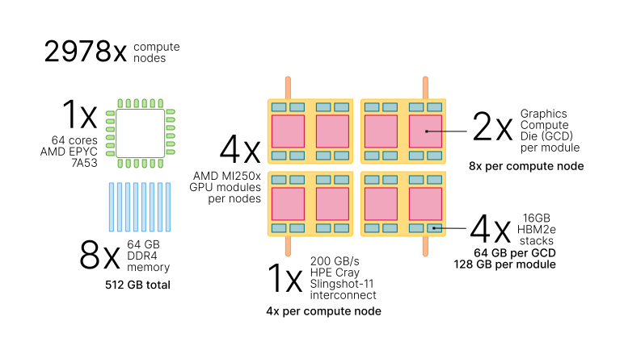

# GPUs on LUMI-G

:::::: {.columns}
::: {.column width="60%"}
{.center width=100%}

<small>LUMI-G Node.</small>
:::
::: {.column width="40%"}
{.center width=60%}

<small>Single AMD MI250X GPU</small>
:::
::::::

# FLOPs (Floating Point Operations)

- FLOPs measure how many arithmetic operations a model performs.
- Commonly used to estimate compute cost of training/inference.
- Training ML Models =  Forward pass + Backward pass.

# AMD MI250X GPU Characteristics
- Compute Power [(Link)](https://www.amd.com/en/products/accelerators/instinct/mi200/mi250x.html)
    - Peak FP64 Performance: 47.9 TFLOPs
    - Peak FP32 Performance: 47.9 TFLOPs
    - Peak FP16 Performance: 383 TFLOPs

- Memory
    - 128 GB HBM2e (64 GB per GCD)

- This numbers are for 2 GCDs with 220 CU.
    - `gpus-per-task=1`  gives you one GCD.

# Peak vs Max-Achievable FLOPs

:::::: {.columns}
::: {.column width="50%"}
{.center width=80%}

<small>Picture from [AMD](https://rocm.blogs.amd.com/software-tools-optimization/Understanding_Peak_and_Max-Achievable_FLOPS/README.html)</small>
:::
::: {.column width="50%"}
- <small>Peak performance is calculated based on the hardware characteristics</small>  
- <small>$FLOPs/s = Cores \times Ops/Cycle \times Clock$</small>  
- <small>Memory Bandwidth Limits, Underutilization, Load Imbalance, etc.</small>  
- <small>Usually **40–70% of Peak FLOPs** in practice</small>
:::
::::::

# ML Parameters vs FLOPs

- **No. Parameters** are static — they define the model size.
- **FLOPs** depend on data:
    - Input size
    - Number of filters, etc
    - dataset size (for total cost)

- A model with few parameters can still have high FLOPs if it processes high-resolution inputs.

# VRAM Usage Breakdown

| Component            | Description                                  |
|---------------------|----------------------------------------------|
| Model Parameters     | Static memory for weights                    |
| Gradients            | Stored during backpropagation                |
| Optimizer States     | e.g., momentum/Adam stats                    |
| Activations          | Largest source — intermediate tensors        |
| Framework Overhead   | Memory allocator, workspace, caching         |

- Peak VRAM usage is dominated by activations in deep CNNs.

# Example: ResNet-152 with CIFAR-100

- **Model Info:**
    - Parameters: ~60.2M
    - Forward FLOPs per image: ~11.5 GFLOPs
    - Backward FLOPs = 2x forward pass [(Link)](https://epoch.ai/blog/backward-forward-FLOP-ratio)
    - Training FLOPs per image: ~34.5 GFLOPs

```python
import fvcore
model = resnet152().to(device)
model.eval()

input = torch.randn(1, 3, 224, 224).to(device)

flops = fvcore.nn.FlopCountAnalysis(model, input)
total_params = sum(p.numel() for p in model.parameters())
```

# VRAM Estimate: ResNet-152 + CIFAR-100 (224x224)

| Component          | FP32 (approx) |
|-------------------|---------------|
| Parameters         | 240 MB        |
| Adam  Optimizer    | 480 MB        |
| Gradients          | 240 MB        |
| Activations*       | ~180 MB       |
| Overhead           | ~1 GB         |
| **Total**          | ~2 GB         |

- For `batch_size=128` VRAM is ~24Gb .

# Example: ResNet-152 with CIFAR-100

- **Per-Image Total FLOPs**  
$11.5 \times 3\ GFLOPs = 34.5\ GFLOPs\ per\ image$

- **Total Epoch FLOPs**  
$FLOPs:\ 34.5\ GFLOPs \times 50000 = 1.725\ PFLOPs$


- **Usable GPU Throughput (Assuming 35% Efficiency)**  
$Usable\ Throughput = 0.40 \times 47.9 = 19.2\ TFLOPs/s$

- **Usable GCD Throughput**    
$TFLOPs = \frac{19.2\ TFLOPs}{2} = 9.6\ TFLOPs/s$

- **Estimate Epoch time**
$Epoch\ Time = \frac{1.725\ PFLOPs}{9.6\ TFLOPs/s} \approx 180\ seconds$


# Real-world performance

- Performance highly depends on Code implementation, I/O, etc.
- That's why profiling matters:
    - Visualize computation, memory, communication.
    - Identify bottlenecks early.
    - Optimize GPU usage efficiently

# Key Takeaways

- FLOPs are a function of input, not just model size.
- VRAM usage is dominated by activations, especially in deep models. 
  - We have control over the `batch_size`
- Mixed precision and parallelism help reach closer to max achievable FLOPs.
- Always measure real-time training performance to understand bottlenecks.
